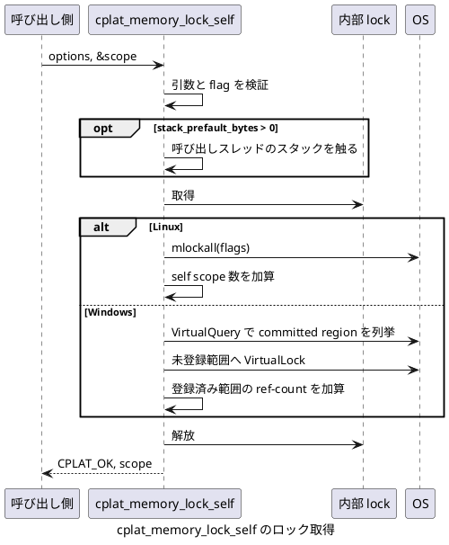
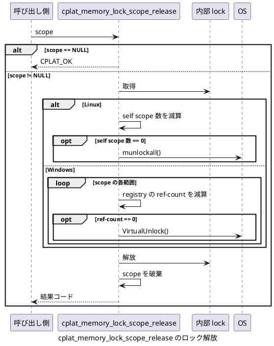

# メモリ ロック API

## 目的

`cplat` は、自プロセスのメモリをページ アウトされにくくする API を `cplat/runtime/memory_lock.h` で提供します。  
対象は呼び出しプロセスのメモリであり、別プロセスのメモリを外側から直接ロックする API ではありません。

この API は、暗号鍵、パスフレーズ、短時間だけ保持する機密バッファーなど、ディスクへのページ アウトを避けたいデータを扱う用途を想定しています。  
ただし、メモリ ロックは休止状態、クラッシュ ダンプ、ログ出力、アプリケーション自身のコピー生成まで防ぐものではありません。  
機密データを扱うコードでは、不要になったバッファーの明示消去やダンプ抑止も別に設計します。

cplat が公開する API 全体の一覧は [cplat API チート シート](api-cheatsheet.md) を参照してください。

## 公開 API

範囲単位の API は Linux と Windows の両方で使用できます。

```c
int cplat_memory_lock_range(const void *address, size_t size);
int cplat_memory_unlock_range(const void *address, size_t size);
```

`address` はロック対象範囲の先頭アドレスです。  
`size` はロック対象範囲のサイズです。  
`address == NULL` または `size == 0` の場合は `CPLAT_ERR_INVALID_ARGUMENT` を返します。  
実際にロックされる範囲は OS のページ単位に丸められます。

プロセス全体の現在分ロックには scope API を使用します。

```c
typedef struct cplat_memory_lock_self_options
{
    int flags;
    size_t stack_prefault_bytes;
} cplat_memory_lock_self_options;

int
cplat_memory_lock_self(const cplat_memory_lock_self_options *options,
                          cplat_memory_lock_scope **scope);

int
cplat_memory_lock_scope_release(cplat_memory_lock_scope *scope);
```

`cplat_memory_lock_self()` が成功すると、解除に必要な情報を `scope` に返します。  
呼び出し側は処理が終わった時点で `cplat_memory_lock_scope_release()` を呼び出します。  
`scope == NULL` を `cplat_memory_lock_scope_release()` に渡した場合は何もせず `CPLAT_OK` を返します。  
成功した `scope` は 1 回だけ `cplat_memory_lock_scope_release()` に渡してください。  
同一 `scope` の二重解放、または複数スレッドからの同時解放は未定義です。  
`options->stack_prefault_bytes` に 0 より大きい値を指定すると、ロック前に呼び出しスレッドのスタックを指定サイズ分だけ触ります。  
この指定は、未使用スタックを先に committed page にしてからロック対象へ含めたい場合に使います。

## flag の意味

`options->flags` には次の flag を指定できます。

| flag | Linux | Windows |
|---|---|---|
| `CPLAT_MEMORY_LOCK_CURRENT` | 現在マップ済みのページを対象にします。 | 現在の committed region を列挙して対象にします。 |
| `CPLAT_MEMORY_LOCK_FUTURE` | 今後追加されるマッピングも対象にします。 | 未対応です。 |
| `CPLAT_MEMORY_LOCK_ONFAULT` | ページ フォルト時にロックします。 | 未対応です。 |

`options == NULL`、`flags == 0`、または未知の bit を含む場合は `CPLAT_ERR_INVALID_ARGUMENT` を返します。  
Windows で `CPLAT_MEMORY_LOCK_FUTURE` または `CPLAT_MEMORY_LOCK_ONFAULT` を指定した場合は `CPLAT_ERR_UNSUPPORTED` を返します。

## スレッド安全性と scope の解放

`cplat_memory_lock_self()` は複数スレッドから同時に呼び出せます。  
呼び出しが成功した場合、呼び出しごとに独立した `scope` が返ります。  
異なる `scope` は任意のスレッドから解放できます。

`cplat_memory_lock_scope_release()` は、異なる `scope` に対する同時呼び出しであればスレッド セーフです。  
同一 `scope` は 1 回だけ解放してください。  
同一 `scope` を複数スレッドから同時に解放したり、解放後に再度渡したりしてはなりません。

範囲 API と scope API は、互いのロック状態を共有しません。  
同じページに対して `cplat_memory_lock_range()` と `cplat_memory_lock_self()` を混在させる場合、解除順序は呼び出し側で管理します。

## stack_prefault_bytes

`stack_prefault_bytes` は、`cplat_memory_lock_self()` の内部で追加消費するスタック サイズです。  
対象は呼び出しスレッドのスタックだけです。  
別スレッドのスタックをロック対象にしたい場合は、そのスレッド自身が `cplat_memory_lock_self()` を呼び出します。

Windows の `CPLAT_MEMORY_LOCK_CURRENT` は、`VirtualQuery()` で列挙した時点の committed region をロックします。  
未使用のスタック予約領域は committed region ではないため、そのままでは `VirtualLock()` の対象に入りません。  
`stack_prefault_bytes` を指定すると、列挙前に呼び出しスレッドのスタックを触るため、その範囲が committed page になり、`CPLAT_MEMORY_LOCK_CURRENT` の対象に入ります。

Linux でも同じ指定を受け付けます。  
`mlockall(MCL_CURRENT)` は呼び出し時点でマップ済みのページを対象にするため、ロック前にスタックを触る意味があります。

指定サイズが現在のスレッド スタックで安全に扱えない場合は、実際にスタックを消費せず `CPLAT_ERR_LIMIT_EXCEEDED` を返します。  
この判定は stack overflow を避けるための安全側の見積もりです。

## scope API のタイミング

`cplat_memory_lock_self()` は、必要に応じて呼び出しスレッドのスタックを先に触ってから、内部 lock を取得して OS のロック API を呼び出します。  
成功した場合は `scope` が返り、呼び出し側はページ フォルトを避けたい処理が終わった後に `cplat_memory_lock_scope_release()` を呼び出します。



`cplat_memory_lock_scope_release()` は内部 lock の下で scope に対応するロック状態を解放します。  
Linux では最後の self scope が解放された時点で `munlockall()` を呼び出し、Windows では ref-count が 0 になった範囲だけ `VirtualUnlock()` を呼び出します。



## Linux の実装

Linux では範囲ロックに `mlock()` を使い、範囲解除に `munlock()` を使います。  
プロセス全体の現在分および将来分ロックには `mlockall()` を使います。  
`mlockall()` はプロセス全体の状態を変更する API です。  
このため、`cplat` は成功した self scope 数をプロセス内で管理し、最後の self scope が解放された時点で `munlockall()` を呼び出します。  
途中の `scope` 解放では、ほかの self scope が維持しているロック状態を解除しません。

一般ユーザーでも `RLIMIT_MEMLOCK` の範囲内でメモリ ロックを使用できます。  
この上限を超えてロックするには `CAP_IPC_LOCK` が必要です。  
現在ロックされている量は `/proc/<pid>/status` の `VmLck` で確認できます。

`CPLAT_MEMORY_LOCK_FUTURE` を指定すると、その後の `mmap()`、`malloc()`、スタック拡張が `RLIMIT_MEMLOCK` によって失敗することがあります。  
呼び出し側は、ロック後のメモリ確保が失敗し得ることを前提にエラー処理を用意します。

## Windows の実装

Windows では範囲ロックに `VirtualLock()` を使い、範囲解除に `VirtualUnlock()` を使います。  
`VirtualLock()` は committed page だけを対象にでき、`PAGE_NOACCESS` や `PAGE_GUARD` のページは対象にできません。  
ロック可能量は working set とシステム制限の影響を受けます。

Windows には Linux の `mlockall(MCL_CURRENT | MCL_FUTURE)` と同じ単一 API はありません。  
`CPLAT_MEMORY_LOCK_CURRENT` については、`GetSystemInfo()` でユーザー空間の範囲を取得し、`VirtualQuery()` で現在の committed region を列挙して `VirtualLock()` を適用します。  
この処理は列挙時点の snapshot に近い実装です。  
列挙中に別スレッドがメモリを確保または解放した場合、対象範囲の変化までは防げません。

Windows の `scope` は `VirtualLock()` に成功した範囲を記録します。  
`cplat` はプロセス内にロック範囲 registry を持ち、重複範囲を ref-count します。  
複数の self scope が同じ committed region を対象にした場合、途中の `scope` 解放では ref-count だけを下げ、最後の `scope` が解放された時点で `VirtualUnlock()` を呼び出します。  
これは、未ロック ページを含む範囲へ `VirtualUnlock()` を呼ぶと失敗し得ることと、Windows がアプリケーション単位の lock count を提供しないことへの対応です。

## 結果コード

結果コードは cplat 共通の結果コード (`int`、`cplat/base/result.h` 参照) で返します。  
本 API で実際に返しうるコードは次のとおりです。

| 結果コード | 意味 |
|---|---|
| `CPLAT_OK` | 成功。 |
| `CPLAT_ERR_INVALID_ARGUMENT` | 引数が不正。 |
| `CPLAT_ERR_UNSUPPORTED` | 対象プラットフォームまたは指定 flag では未対応。 |
| `CPLAT_ERR_PERMISSION_DENIED` | 権限不足。 |
| `CPLAT_ERR_LIMIT_EXCEEDED` | ロック可能量またはリソース上限を超過。 |
| `CPLAT_ERR_UNKNOWN` | 上記以外の OS エラー。 |

errno および Windows の `GetLastError()` の値は、共通ヘルパー `cplat_result_from_errno()` /  
`cplat_result_from_windows_error()` (`cplat/base/result_internal.h`) を通じて結果コードへ変換します。  
ただし、ロック可能量の上限超過を示すエラーはこの API に固有の意味を持つため、共通ヘルパーより前段で個別に判定します。

Linux では `EPERM` を `CPLAT_ERR_PERMISSION_DENIED` に対応させます (共通ヘルパーの分類)。  
Linux の `ENOMEM` は、mlock 系のロック可能量上限超過を意味するため、共通ヘルパーとは別に `CPLAT_ERR_LIMIT_EXCEEDED` に対応させます。  
Windows では `ERROR_ACCESS_DENIED` と `ERROR_PRIVILEGE_NOT_HELD` を `CPLAT_ERR_PERMISSION_DENIED` に対応させます (共通ヘルパーの分類)。  
Windows のワーキング セットやシステム リソース不足を示すエラー (`ERROR_NOT_ENOUGH_MEMORY`、`ERROR_WORKING_SET_QUOTA`、`ERROR_COMMITMENT_LIMIT`、`ERROR_NO_SYSTEM_RESOURCES`) は、共通ヘルパーとは別に `CPLAT_ERR_LIMIT_EXCEEDED` に対応させます。

## 使用例

範囲ロックは、機密データを格納するバッファーの寿命に合わせて使用します。

```c
#include <cplat/runtime/memory_lock.h>

unsigned char secret[64];
int result = cplat_memory_lock_range(secret, sizeof(secret));
if (result != CPLAT_OK)
{
    /* ロックできない場合の扱いを呼び出し側で決める。 */
}

/* secret を使用する。 */

(void)cplat_memory_unlock_range(secret, sizeof(secret));
```

自プロセスの現在分をまとめてロックする場合は、scope を保持します。

```c
#include <cplat/runtime/memory_lock.h>

cplat_memory_lock_scope *scope = NULL;
cplat_memory_lock_self_options options = {0};
options.flags = CPLAT_MEMORY_LOCK_CURRENT;

int result = cplat_memory_lock_self(&options, &scope);
if (result == CPLAT_OK)
{
    /* ページ フォルトを避けたい処理を実行する。 */
}

(void)cplat_memory_lock_scope_release(scope);
```

Linux で将来分も対象にする場合は、`CPLAT_MEMORY_LOCK_FUTURE` を併用します。

```c
cplat_memory_lock_scope *scope = NULL;
cplat_memory_lock_self_options options = {0};
options.flags = CPLAT_MEMORY_LOCK_CURRENT | CPLAT_MEMORY_LOCK_FUTURE;
int result = cplat_memory_lock_self(&options, &scope);
```

この指定は Windows では `CPLAT_ERR_UNSUPPORTED` を返します。

Windows で現在のスレッド スタックを追加で 64 KiB 触ってから現在分をロックする例です。

```c
cplat_memory_lock_scope *scope = NULL;
cplat_memory_lock_self_options options = {0};
options.flags = CPLAT_MEMORY_LOCK_CURRENT;
options.stack_prefault_bytes = 64U * 1024U;
int result = cplat_memory_lock_self(&options, &scope);
```

## 注意点

同じページに対して範囲 API と scope API を混在させる場合、解除順序は呼び出し側で管理します。  
特に Windows では OS 側にアプリケーション単位の lock count が見えないため、同じ範囲を複数の経路で扱うと解除単位が衝突することがあります。

メモリ ロックに失敗した場合でも、処理を継続するか中止するかは呼び出し側の要件で決めます。  
機密データの扱いでは失敗時に処理を中止する設計が自然です。  
リアルタイム処理では、失敗時にページ フォルト発生を許容するかどうかを明示します。

## 参考資料

- Linux `mlock(2)`: <https://man7.org/linux/man-pages/man2/mlock.2.html>
- Linux capabilities: <https://man7.org/linux/man-pages/man7/capabilities.7.html>
- Linux `getrlimit(2)`: <https://man7.org/linux/man-pages/man2/getrlimit.2.html>
- Microsoft `VirtualLock`: <https://learn.microsoft.com/windows/win32/api/memoryapi/nf-memoryapi-virtuallock>
- Microsoft `VirtualUnlock`: <https://learn.microsoft.com/windows/win32/api/memoryapi/nf-memoryapi-virtualunlock>
- Microsoft `VirtualQuery`: <https://learn.microsoft.com/windows/win32/api/memoryapi/nf-memoryapi-virtualquery>
- Microsoft `GetSystemInfo`: <https://learn.microsoft.com/windows/win32/api/sysinfoapi/nf-sysinfoapi-getsysteminfo>
- Microsoft privilege constants: <https://learn.microsoft.com/windows/win32/secauthz/privilege-constants>
